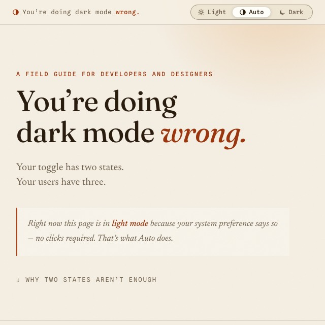

# You’re doing dark mode wrong.

<picture>
  <source media="(prefers-color-scheme: dark)" srcset="screenshots/dark.jpg">
  
</picture>

A one-page site for developers and designers about the most common dark-mode mistake: the two-state theme toggle. It makes the case for three states — **Light / Dark / Auto**, with Auto as the default — and demonstrates the pattern by implementing it itself.

For the full argument, the code, and further reading: open the site.

## Run

Open `index.html` in a browser. No build step, no dependencies.

## Stack

One HTML file plus self-hosted fonts ([Fraunces](https://fonts.google.com/specimen/Fraunces), [Newsreader](https://fonts.google.com/specimen/Newsreader), [Spline Sans Mono](https://fonts.google.com/specimen/Spline+Sans+Mono)) — vanilla CSS and JS, no external requests.

## License

[MIT](LICENSE) — the implementation is free to copy. The fonts are licensed separately under the [SIL Open Font License 1.1](fonts/LICENSE).
